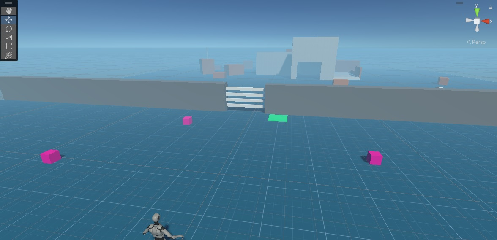

# Icarus Project Template for Unity

## READ THIS FIRST

This template is using Unity **2021.3.7f1**

Clone this repo and create a branch off of `main` before starting. All your changes should be on that branch. Once you are done, create a Pull Request (PR). This will signify to us that you are complete.

## Provided Assets, Files, and Settings

* This demo is built the 3rd Person Template from Unity.
* This demo uses the Universal Rendering Pipeline (URP)
* A basic level
* Some rough models made using primitives:
  * Gate Door
  * Pressure Plate
  * Laser Turret
  * Laser Target

## Main Info

This is just a simple game where the player needs to solve specific puzzles to progress to the next level.

### Test Objectives

1. When you load into the game, you'll notice a pressure plate on the ground and three "weighted cube" objects around you. Your objective is to add the ability to interact and pick-up/drop those cubes on the pressure plate. The pressure plate should open the door when it has three cubes on it.
2. After passing through the door, there will be a turret on your right-hand side. Create a button that fires a single laser projectile when interacted.
3. The laser projectile should be bounce off of mirrors and die when they hit non-mirror surfaces.
4. Create a mirror object that can be picked-up, dropped, rotated
5. The level should finish when a laser hits the laser target. The default laser target location is behind the main building on the wall.

You are expected to code all the mechanics and create (or yoink from the internet) any assets you require. The game doesn't have to be very pretty; you have all the creative freedom you want.

Any lag or stutter in this small demo will not be acceptable. You are expected to optimize the game to run smoothly.

## Game Requirements

* Main Menu Scene
* Ability to pick up and drop weighted cubes
* Weighted Cubes have outline shader when aimed at by player + within range
* Gate Door opens once player places 3 cubes on pressure plate
* Ability to activate Laser Turret (single fire)
* Laser projectiles should bounce off mirror surfaces
* Ability to win when laser projectile hits target
* Win Scene

## Some Ideas that would be nice to have (Show us your flexes 💪)

* Text overlay when player can interact with objects/buttons
* More levels
* Audio
* Laser VFX (I recommend using Unity's Particle Systems)
* A pause menu
* Door opening animation

## Recommended Button Scheme (Let us know if you change this)

* WASD for Movement
* Spacebar for Jump
* E or F or LeftClick for Interact
* Shift to Sprint
* Mouse for camera control

## Unity's New Input System

This project template is currently using Unity's new Input system. If you prefer to use Unity's legacy input system, you will need to change the settings.

Documentation on the new system:
<https://docs.unity3d.com/Packages/com.unity.inputsystem@1.4/manual/index.html>

## Contacting Me and Final Thoughts

In the Pull Requests tab, there should be an auto generated PR called "Feedback". Leave comments and questions in there and I will respond when I get a chance.  

Good luck and have some fun with this. The objective of this test is to see your coding style, problem solving skills, and your passion for video games.
